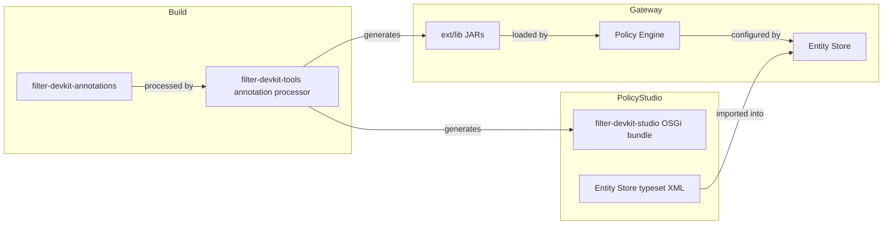
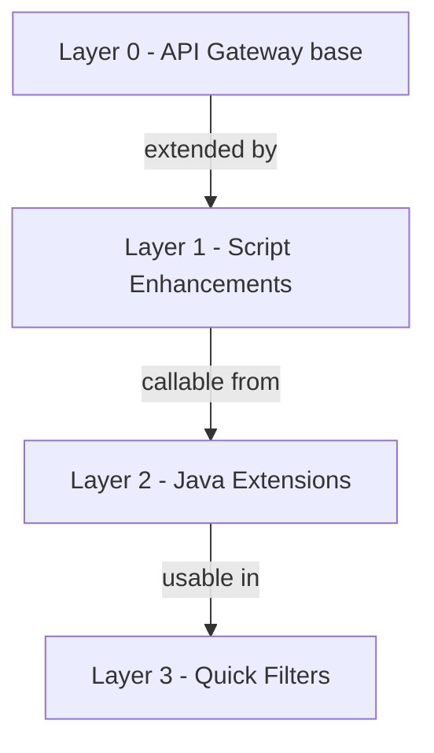
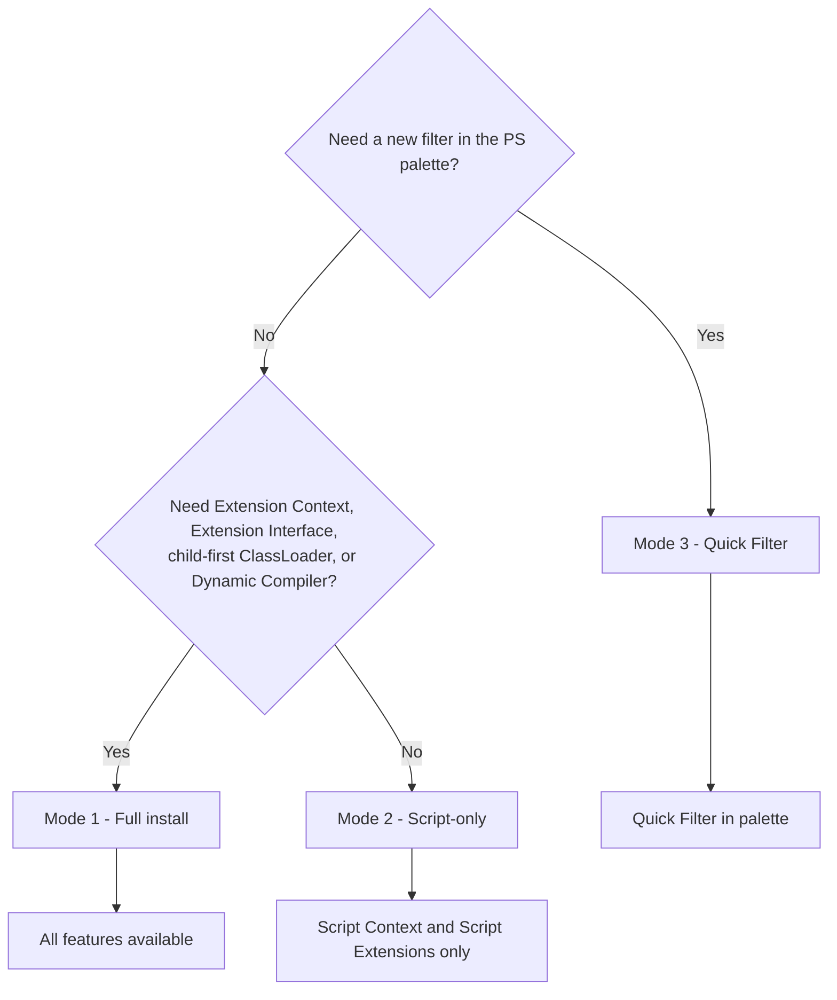
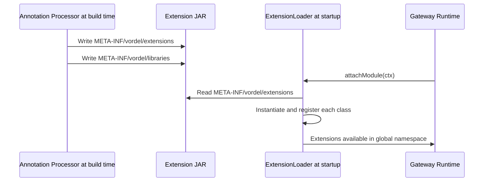
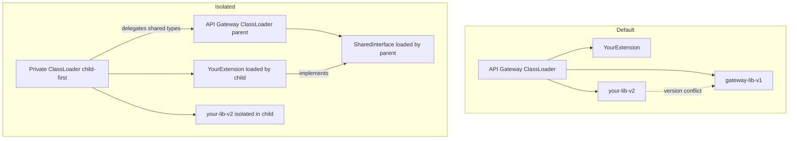
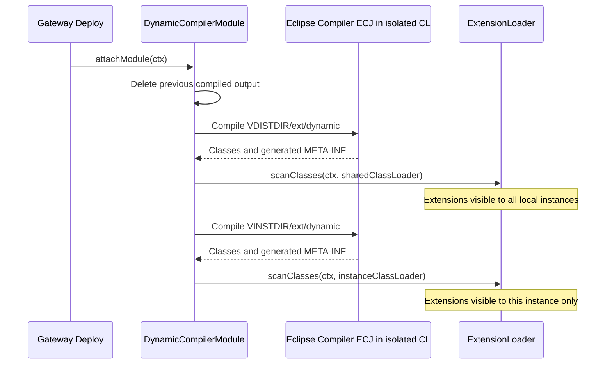

# Architecture

This document describes how the Filter DevKit fits inside the API Gateway runtime, how its components relate to each other, and how class loading works.

---

## FDK in the API Gateway ecosystem

The API Gateway processes messages through **policies** — chains of **filters**. Each filter is a Java class whose configuration is stored in the Entity Store and whose UI is defined in Policy Studio. The FDK adds new extension points at every layer of this stack.

---

## FDK component map

| Module | Role | Deployed to |
|---|---|---|
| `filter-devkit-annotations` | Compile-time annotations only; no runtime dependency | Build classpath |
| `filter-devkit-tools` | Annotation processor; generates filter boilerplate | Build classpath |
| `filter-devkit-runtime` | Core runtime: extension loader, script filter, resource system | Gateway `ext/lib` |
| `filter-devkit-studio` | Policy Studio OSGi bundle; embeds `filter-devkit-annotations` and `filter-devkit-runtime` | Policy Studio `dropins` or `plugins` |
| `filter-devkit-dynamic` | Deploy-time Java compiler | Gateway `ext/lib` |
| `filter-devkit-plugins-eval` | Extended Eval Selector filter (example Quick Filter) | Gateway `ext/lib` + PS `dropins` |
| `filter-devkit-plugins-*` | Other bundled filters and extensions | Gateway `ext/lib` + PS `dropins` |

> `filter-devkit-runtime` is **not** deployed to Policy Studio. Policy Studio uses `filter-devkit-studio`, which is a dedicated OSGi bundle that embeds both `filter-devkit-annotations` and `filter-devkit-runtime`.

---

## The FDK layer model

| Layer | Features | Typeset required |
|---|---|:---:|
| **0** — API Gateway base | Script Filter, Custom Filter, Selectors | — |
| **1** — Script Enhancements | Advanced Script Filter, Script Context, Script Extensions | Advanced Script Filter only |
| **2** — Java Extensions | Extension Context, Extension Interface, Child-first ClassLoader | **Yes** |
| **3** — Quick Filters | Full PS palette filter with generated UI | No (own typeset); runtime required |

Note: some Quick Filter plugins register additional extensions that are only available when the main FDK typeset is also imported.

---

## Installation modes

---

## Metadata layout

The annotation processor generates index files embedded in extension JARs at build time. At startup the gateway reads those files directly — no classpath walk, no bytecode analysis.

| File | Purpose |
|---|---|
| `META-INF/vordel/extensions` | List of extension class names to instantiate at startup |
| `META-INF/vordel/libraries/{className}` | JARs to include in the extension's isolated child-first ClassLoader |
| `META-INF/vordel/forceLoad/{className}` | Classes that must share the extension's ClassLoader (inner classes, anonymous classes) |
| `META-INF/vordel/scriptextensions/{className}` | Script extension interfaces implemented by the class |

This layout means extension discovery has zero startup overhead proportional to classpath size — the gateway reads a fixed set of small index files rather than scanning all loaded classes.

---

## Extension discovery

FDK extensions are discovered at gateway startup via a service-loader-like mechanism driven by the annotation processor. No manual registration is needed.

---

## Class loading architecture

By default, all JARs in `ext/lib` share the API Gateway class loader. This causes problems when your library ships a different version of a class already loaded by the gateway. The `@ExtensionLibraries` annotation activates a private child-first class loader for the annotated class.

The shared interface must not reference any class from the isolated library. The implementation can use the library freely; only the interface boundary must be clean.

---

## Dynamic Compiler

The Dynamic Compiler is an extension module with the lowest load priority (`@Priority(Integer.MAX_VALUE)`), so it is configured last — after all static extensions are already loaded. This means dynamic sources can reference classes from any static JAR already on the class path. It uses the Eclipse Compiler for Java (ECJ) running in its own isolated child-first class loader.

No compiled class is available outside registered extensions — the compiler output is only accessible through the normal extension discovery mechanism described above.

`VDISTDIR` is the shared API Gateway distribution directory. Extensions compiled from it are loaded into a class loader shared by all local gateway instances (Linux processes). `VINSTDIR` is a specific gateway instance directory. Extensions compiled from it are loaded into that instance's class loader only.

Compiled classes are discarded on shutdown and recompiled fresh on every deployment.
