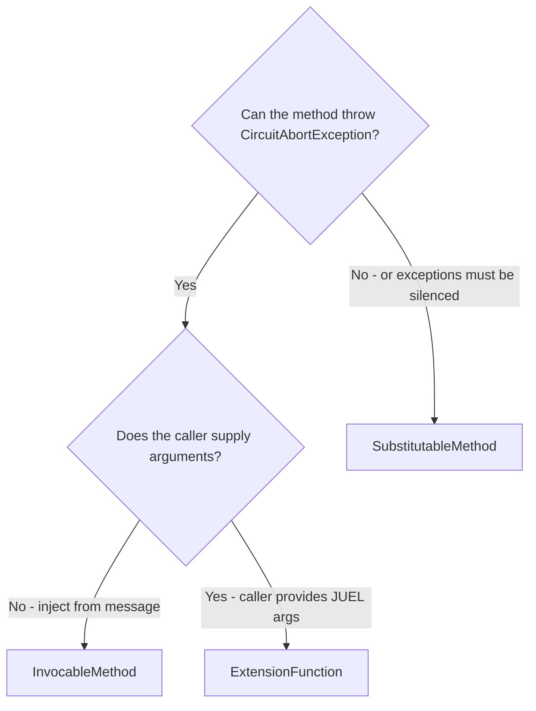
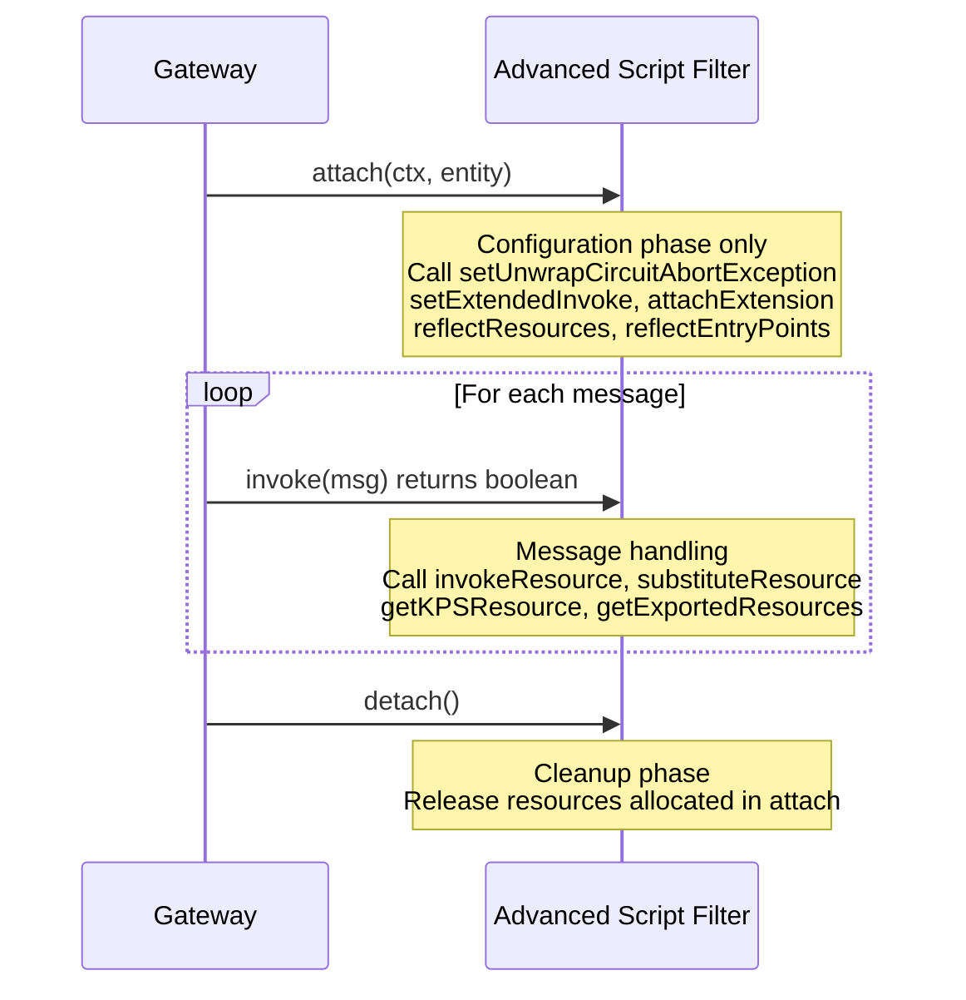

# Concepts

This document explains the mental model behind the FDK. Read it before diving into any feature guide.

---

## The API Gateway extension model

The API Gateway processes messages through **filters** arranged in **policies**. Filters read and write **message attributes** — a string-keyed dictionary attached to each message. Configuration values, including filter parameters, are stored in the **Entity Store**.

**Selectors** are the gateway's expression language, built on **JUEL** (Java Unified Expression Language, JSR-341) — the same Java standard used in JSP, JSF, and CDI. The `${…}` delimiter is standard JUEL syntax. The gateway extends JUEL with a root context backed by the current message dictionary, gateway-specific built-in functions, and automatic type coercion to Java types.

The FDK builds on JUEL: Extension Context methods are registered as JUEL functions under the `extensions` namespace, and `@ExtensionFunction` lets callers pass JUEL sub-expressions as method arguments.

The three native extension points are:

- **Scripts** — a Script Filter in the Policy Studio palette. Scripts run JSR-223 code (Groovy, JavaScript, Python). They are configured filters, not inline code.
- **Custom Filters** — a Java class extending `MessageProcessor`, with a typeset and UI definition in Policy Studio.
- **Selectors** — JUEL expressions evaluated against the message; limited by default to reading attributes and a small set of built-in functions.

> Quick Filters extend `JavaQuickFilterDefinition`, not `MessageProcessor` directly. The generated `MessageProcessor` wrapper is produced by the annotation processor.

---

## JUEL selector internals

Understanding how the gateway evaluates selectors helps explain FDK behaviour and avoids common mistakes.

### Dot notation is map access

In JUEL, `.` is the map access operator. The following are equivalent:

```
${http.querystring.name}
${http["querystring"]["name"]}
${http['querystring']['name']}
```

### Lazy attribute lookup via slice objects

The gateway does not pre-populate a nested object tree in the message dictionary. Instead, it uses a lazy lookup mechanism:

1. JUEL asks the root context for `http` → the gateway calls `msg.get("http")`.
2. If `http` is not a known flat attribute, the gateway returns an internal **slice** object that records the `"http"` prefix and implements `Map`.
3. JUEL uses the slice as a `Map` and asks for `querystring` → the slice prepends its prefix and calls `msg.get("http.querystring")`.
4. `http.querystring` typically returns a `HeaderSet` object, which also implements `Map`.
5. JUEL asks the `HeaderSet` for `name` → the `HeaderSet` looks up the header value.

This is why attribute names containing dots (such as `"http.querystring"`) are perfectly valid keys and how the gateway resolves multi-segment selector paths efficiently.

### Write syntax is not implemented

JUEL defines an assignment expression syntax (`${x = value}`). The gateway does not implement it — selectors are **read-only**. Attribute values are set directly via Java API (`msg.put(key, value)`) or through filter actions.

### Incomplete resolution

When an attribute does not exist at any level of the lookup chain, the standard gateway selector returns the literal string `[invalid field]` rather than `null`. The FDK resource system detects incomplete resolution and returns `null` instead, which is easier to handle safely in code.

---

## Resources

**Resources** are the central abstraction in the FDK. A resource is a named, typed handle to a gateway object — a policy, a KPS table, a cache, or a selector expression.

Without FDK resources, calling a policy from a script means hardcoding its name as a string. Policy Studio cannot track that reference. If the policy is renamed, the script breaks silently, and exporting the script does not export the policy it calls.

With FDK resources, you declare the association in the filter configuration. These declared dependencies are called **context links** — they are stored in the Entity Store so that Policy Studio can see the reference, propagate renames, and include the target in fragment exports. Plain string references inside script text are invisible to Policy Studio and receive none of these guarantees.

| Resource type | Backed by | Retrieved with |
|---|---|---|
| `InvocableResource` | A policy | `getInvocableResource(name)` |
| `SubstitutableResource` | A selector expression | `getSubstitutableResource(name)` |
| `KPSResource` | A KPS table | `getKPSResource(name)` |
| `CacheResource` | A cache | `getCacheResource(name)` |
| `FunctionResource` | A Java or Groovy method | `getFunctionResource(name)` |

---

## The method export triad

This is the most important concept in the FDK. Whenever you expose a Java method to the gateway — from an Extension Context, a Quick Filter definition, or a Groovy script — you must choose one of three export types. Each has a distinct contract.



### @InvocableMethod

Returns `boolean`. Can throw `CircuitAbortException`. Arguments are injected from the message — no caller-supplied values. Use when the method acts like a policy: it succeeds or fails and can abort the circuit.

Call site: `${extensions['myext'].myMethod}` — use the **Extended Eval Selector** filter. The standard Eval Selector filter throws a generic exception with no cause when the expression fails, losing the `CircuitAbortException` root cause. The Extended Eval Selector filter relays it correctly.

### @SubstitutableMethod

Returns any type. Arguments are injected from the message. Exceptions are caught, logged at DEBUG level, and the selector evaluates to `null`. Use when the method computes a value for use in Set Attribute, Copy/Modify, Set Message, or any value-producing context.

Call site: `${extensions['myext'].myMethod}` — safe to use anywhere selectors are accepted.

### @ExtensionFunction

Returns any type. The first parameter is always `Message` (injected automatically). Remaining parameters come from JUEL sub-expressions at the call site. Can throw `CircuitAbortException`.

Call site: `${extensions['myext'].myMethod(http.querystring.name, http.querystring.lang)}`

> **Caution with JavaScript:** variable-argument methods cannot be exported to JavaScript scripts, and JUEL type coercion can behave unexpectedly outside Java's strong type system.

---

## Parameter injection

For `@InvocableMethod` and `@SubstitutableMethod`, parameters are injected automatically:

| Parameter | Annotation | Injected value |
|---|---|---|
| `Message` or `Dictionary` | *(none required)* | The current message |
| Any type | `@DictionaryAttribute("key")` | `msg.get("key")` coerced to the parameter type |
| Any type | `@SelectorExpression("expr")` | `${expr}` evaluated on the message, coerced |

Both `Message` and `Dictionary` may appear in the same method. If a `Dictionary` is provided where `Message` is requested, `null` is injected.

---

## The typeset and what it controls

The **typeset** is an XML descriptor imported into the Entity Store via Policy Studio (**File → Import → Import Custom Filter**). It declares new **entity types** — the data structures that Policy Studio stores in the Entity Store — including their configuration fields.

The UI for those entity types (tabs, panels, field layouts) is defined in `ui.xml` files embedded in the filter JAR itself, not stored in the Entity Store.

Without the typeset:
- The Advanced Script Filter is not available at all (it is not just missing the Resources tab — the filter type does not exist in the Entity Store).
- The global extension namespace (`${extensions['name']…}`) is not registered.
- Extension Interface, child-first ClassLoader, and `ExtensionModule` lifecycle are not available.

With the typeset:
- All features are unlocked.
- The Resources tab is available on the Advanced Script Filter.

The typeset file is `filter-devkit-runtime/src/main/typesets/apigwsdkset.xml`.

---

## Script lifecycle

The attach / invoke / detach lifecycle applies **only to the Advanced Script Filter**. The standard gateway Script Filter does not implement this lifecycle.



`attach` and `detach` are optional. If `reflectEntryPoints()` is called in `attach`, the Groovy runtime discovers strongly-typed `invoke()` and `detach()` signatures with injected parameters.
