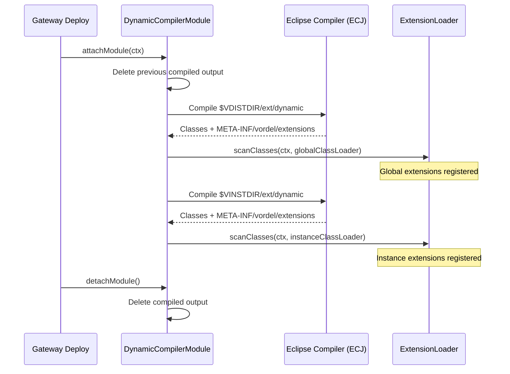

# Dynamic Compiler

The Dynamic Compiler compiles Java source files at gateway deployment time, without a gateway restart. It requires the FDK typeset to be imported — the typeset registers the extension module lifecycle that the Dynamic Compiler hooks into. It is designed to speed up the local development cycle: modify a `.java` file, redeploy, and your changes are live.

---

## How it works

The Dynamic Compiler is itself an FDK extension module (`DynamicCompilerModule`) with the highest load priority. It runs during `attachModule`, before any other extension scanning, using the Eclipse Compiler for Java (ECJ) running in an isolated child-first class loader.



Compiled classes are discarded on shutdown. They are recompiled fresh on every deployment.

---

## Directory layout

```
$VDISTDIR/
  ext/
    lib/
      filter-devkit-dynamic.jar     ← the Dynamic Compiler module itself
    extra/
      compiler/
        ecj-*.jar                   ← Eclipse compiler
        filter-devkit-tools.jar     ← annotation processor
      compiled/                     ← output: global compiled classes (managed by module)
    dynamic/                        ← input: global Java sources (create to enable)

$VINSTDIR/
  ext/
    extra/
      compiled/                     ← output: instance compiled classes (managed by module)
    dynamic/                        ← input: instance-specific Java sources (create to enable)
```

The compiler is enabled per directory: if `ext/dynamic/` does not exist, compilation for that scope is silently skipped. Global compiled classes (`VDISTDIR`) are visible to instance classes (`VINSTDIR`).

---

## Supported features

Compiled classes go through the same annotation processor and extension scanning as static JARs. All FDK extension types work:

- `@ExtensionContext` — expose methods as selectors
- `@ExtensionInstance` — register an interface implementation
- `@ScriptExtension` — add script top-level functions

**Not supported:** the child-first ClassLoader (`@ExtensionLibraries`). The compiler does not know the external class path at compile time, so it cannot build the isolated class loader. Use a static JAR for extensions that need dependency isolation.

---

## Manual installation

The `deployRuntime` Gradle task handles all of this automatically. If you need to install manually:

1. Create `$VDISTDIR/ext/extra/compiler/` and copy `ecj-*.jar` and `filter-devkit-tools.jar` into it.
2. Copy `filter-devkit-dynamic.jar` to `$VDISTDIR/ext/lib/`.
3. Create `$VDISTDIR/ext/dynamic/` to enable global compilation.
4. For each instance, create `$VINSTDIR/ext/dynamic/` to enable per-instance compilation.

---

## When to use it

| Use case | Dynamic Compiler | Static JAR |
|---|:---:|:---:|
| Rapid local development iteration | ✓ | — |
| Production deployment | — | ✓ |
| Dependency isolation (`@ExtensionLibraries`) | — | ✓ |
| Extension that needs external libraries | — | ✓ |
| Simple extension with no external deps | ✓ | ✓ |

The Dynamic Compiler is a development tool. For production, compile to a static JAR and deploy it to `ext/lib`.
