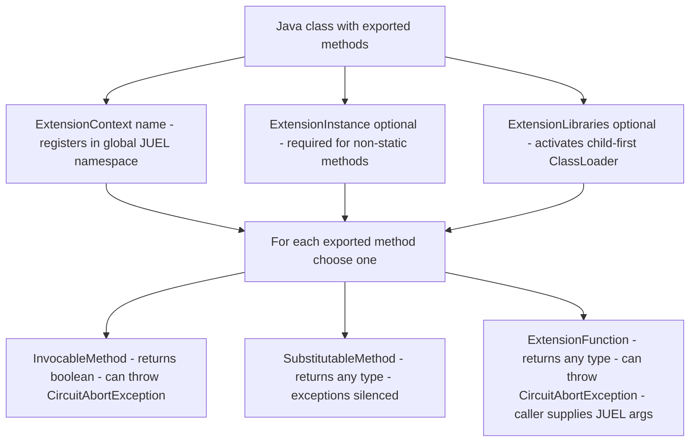
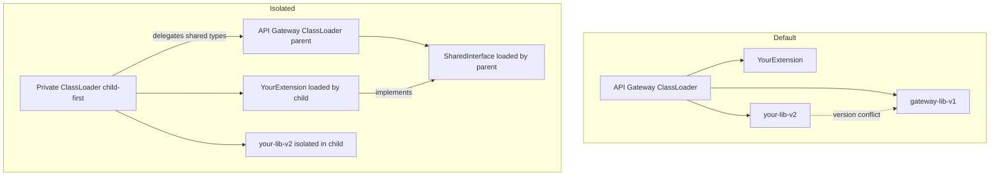

# Java Extensions

Java Extensions expose Java code directly to the API Gateway runtime — as selector-callable methods, as interfaces shared with custom filters, or as isolated modules with their own class path. Read [Concepts — The method export triad](Concepts.md#the-method-export-triad) first.

---

## Extension Context

**Extension Context** registers a Java class so that its methods can be called from any JUEL selector expression in the gateway. It improves on JUEL's built-in reflection resolver in three ways:

- **Configuration-time registration.** Methods are registered when the configuration is loaded, not resolved on every invocation. This avoids the per-call reflection overhead of the plain JUEL resolver.
- **Message injection from resolver context.** The current message is retrieved directly from the JUEL resolver context and passed as the first argument. With the plain JUEL resolver the message is not part of the JUEL context at all, so Java methods have no way to access it without a workaround.
- **Automatic parameter type coercion.** Arguments are resolved and coerced to the declared Java type by the FDK injection mechanism. With plain JUEL reflection the caller must ensure argument types match exactly, often requiring intermediate "glue" filters to convert values before the call.

Registered methods are callable as:

```
${extensions['myext'].myMethod}
${extensions['myext'].myMethod(arg1, arg2)}
```

This works in Set Attribute, Set Message, Copy/Modify, the Extended Eval Selector filter, scripts, and anywhere else the gateway accepts a selector.

### Instantiation modes

The FDK instantiation behaviour depends on whether the typeset is installed:

| Mode | Condition | Behaviour |
|---|---|---|
| **Global singleton** | Typeset imported, `@ExtensionInstance` present | One instance created at startup; registered in the global JUEL namespace `${extensions['name']}` |
| **Static reflection only** | No typeset (typeset is required for Extension Context) | Global namespace not available; static methods can be reflected into Script Context via `builder.reflectClass()` only |

> Extension Context requires the FDK typeset to be imported. Without it, the global `${extensions[…]}` namespace is not registered and Extension Context methods are not accessible from selectors.

### Minimal example — static method (no @ExtensionInstance needed)

For a simple, self-contained extension, a static method requires no instantiation annotation:

```java
import com.vordel.circuit.filter.devkit.context.annotations.ExtensionContext;
import com.vordel.circuit.filter.devkit.context.annotations.SubstitutableMethod;
import com.vordel.circuit.filter.devkit.context.annotations.SelectorExpression;

@ExtensionContext("hello")
public class HelloExtension {

    @SubstitutableMethod
    public static String greet(
            @SelectorExpression("http.querystring.name") String name) {
        return "Hello, " + name + "!";
    }
}
```

Selector call: `${extensions['hello'].greet}`

The annotation processor writes the class name to `META-INF/vordel/extensions`. The extension loader picks it up at gateway startup.

### Example with instance methods

If your methods need instance state, add `@ExtensionInstance`:

```java
import com.vordel.circuit.filter.devkit.context.annotations.ExtensionContext;
import com.vordel.circuit.filter.devkit.context.annotations.ExtensionInstance;
import com.vordel.circuit.filter.devkit.context.annotations.InvocableMethod;
import com.vordel.circuit.filter.devkit.context.annotations.DictionaryAttribute;
import com.vordel.circuit.CircuitAbortException;
import com.vordel.circuit.Message;

@ExtensionInstance
@ExtensionContext("auth")
public class AuthExtension {

    @InvocableMethod
    public boolean checkToken(Message msg,
            @DictionaryAttribute("http.headers.Authorization") String auth)
            throws CircuitAbortException {
        if (auth == null || !auth.startsWith("Bearer ")) {
            throw new CircuitAbortException("Missing or invalid Authorization header");
        }
        return true;
    }
}
```

### Annotation rules



**Annotation processor invariants:**
- All exported methods must be `public`.
- `@ExtensionFunction` is mutually exclusive with `@InvocableMethod` and `@SubstitutableMethod` on the same method.
- `@InvocableMethod` must return `boolean`.
- Without `@ExtensionInstance`, only `static` methods can be exported.
- Two different methods cannot be exported under the same name.

### Parameter injection for @InvocableMethod and @SubstitutableMethod

| Parameter | Annotation | Injected value |
|---|---|---|
| `Message` | *(none)* | The current message |
| `Dictionary` | *(none)* | The current message as `Dictionary` |
| Any type | `@DictionaryAttribute("key")` | `msg.get("key")` coerced to the parameter type |
| Any type | `@SelectorExpression("expr")` | `${expr}` evaluated on the message, coerced |

### @ExtensionFunction parameter rules

First parameter must be `Message` or `Dictionary` — injected automatically. Remaining parameters come from JUEL sub-expressions at the call site:

```java
@ExtensionFunction
public String format(Message msg, String template, String value) {
    return template.replace("{}", value);
}
```

```
${extensions['myext'].format("Hello {}!", http.querystring.name)}
```

### Without the typeset

Without the typeset, the global `${extensions['name']…}` JUEL namespace is not registered. Static methods can still be reflected into Script Context via `builder.reflectClass(YourClass.class)`, but there is no gateway-wide selector access.

---

## Extension Interface

**Extension Interface** lets you share a Java interface between the FDK runtime and a custom filter or another extension module. The implementation is retrieved by interface type at runtime via `ExtensionLoader`.

### When to use it

Use Extension Interface when an existing custom filter needs access to a Java module that should be independently deployable and potentially isolated with its own class path.

### Implementation

**Step 1 — Define the interface** in a shared JAR on the API Gateway class path:

```java
public interface TokenValidator {
    boolean isValid(String token) throws Exception;
}
```

**Step 2 — Implement and annotate** (register under the interface type):

```java
import com.vordel.circuit.filter.devkit.context.annotations.ExtensionInstance;

@ExtensionInstance(TokenValidator.class)
public class TokenValidatorImpl implements TokenValidator, ExtensionModule {

    @Override
    public boolean isValid(String token) {
        return token != null && token.length() > 32;
    }

    @Override
    public void attachModule(ConfigContext ctx) throws EntityStoreException { }

    @Override
    public void detachModule() { }
}
```

**Step 3 — Retrieve in your custom filter:**

```java
import com.vordel.circuit.filter.devkit.context.ExtensionLoader;

TokenValidator validator = ExtensionLoader.getExtensionInstance(TokenValidator.class);
boolean ok = validator.isValid(token);
```

> **Constraint:** The shared interface must not reference any class from the module's isolated library. Only the implementation class uses the foreign class path.

---

## ExtensionModule lifecycle

Any extension class can implement `ExtensionModule` to receive attach and detach callbacks tied to the gateway configuration lifecycle. This requires the typeset to be installed for global registration; without the typeset, the callbacks are not invoked.

```java
import com.vordel.circuit.filter.devkit.context.ExtensionModule;
import com.vordel.config.ConfigContext;
import com.vordel.es.EntityStoreException;

@ExtensionContext("myext")
public class MyExtension implements ExtensionModule {

    @Override
    public void attachModule(ConfigContext ctx) throws EntityStoreException {
        // Called when the gateway configuration is loaded or redeployed.
        // Safe to access the Entity Store here.
        // Initialize connection pools, start background threads, etc.
    }

    @Override
    public void detachModule() {
        // Called before shutdown, restart, or redeployment.
        // Release all resources acquired in attachModule().
    }
}
```

`attachModule` receives the `ConfigContext`, which provides access to the Entity Store. Use it to read configuration that your extension needs at startup. `detachModule` is always called before a new `attachModule`, so resources from the previous deployment are guaranteed to be released before a redeployment is applied.

Loading order across multiple extension modules is controlled with `@Priority` — lower value means higher priority. The Dynamic Compiler uses `@Priority(Integer.MAX_VALUE)` to ensure it runs before all other extensions.

---

## Dependency isolation (child-first ClassLoader)

When your extension depends on a library that conflicts with a version already loaded by the API Gateway, the `@ExtensionLibraries` annotation activates a private child-first class loader for the annotated class.



### Usage

```java
@ExtensionInstance(MyInterface.class)
@ExtensionLibraries("${environment.VDISTDIR}/ext/mylib")
public class MyExtensionImpl implements MyInterface, ExtensionModule {
    // Uses classes from mylib freely.
}
```

The value of `@ExtensionLibraries` supports JUEL selector syntax and can point to a directory or a specific JAR. Multiple paths can be provided as an array.

### Handling inner and anonymous classes

Only the annotated class itself is loaded in the private class loader by default. For inner or anonymous classes, use one of:

1. **Single class** — implement everything inline with no inner or anonymous classes.
2. **Explicit class list** — add binary names to the `classes` attribute of `@ExtensionLibraries`.
3. **@ExtensionLink** — annotate each additional class with `@ExtensionLink(YourExtension.class)`.
