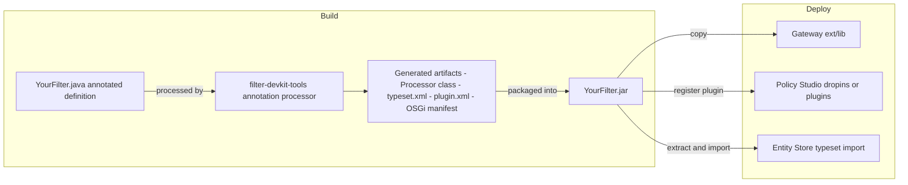
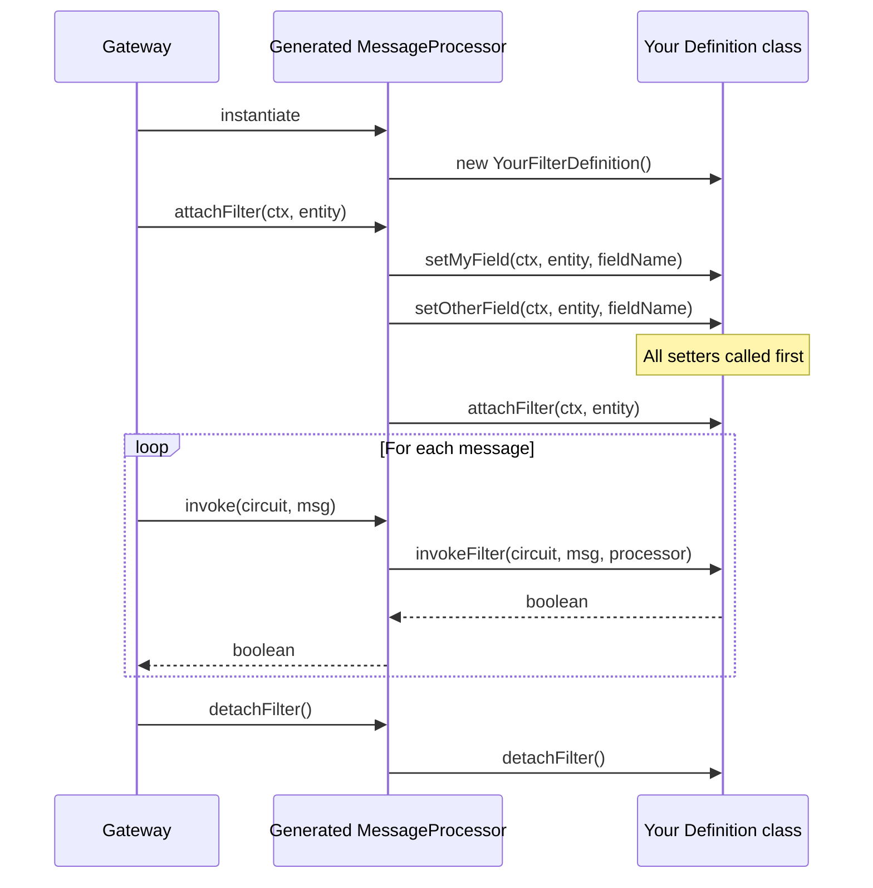

# Java Quick Filters

A **Java Quick Filter** is a standard API Gateway filter that appears in the Policy Studio palette, has a configuration UI, stores its settings in the Entity Store, and is implemented entirely in Java with an annotated definition class. The FDK annotation processor generates all the boilerplate from a single source file.

Quick Filter archives are self-contained: each archive includes its own typeset and PS plugin. You do not need to install the base FDK typeset to use a Quick Filter. However, `filter-devkit-runtime` must be installed in the gateway `ext/lib` — Quick Filters depend on the runtime JAR even though they carry their own typeset. However, some Quick Filter plugins register additional extensions that are only available when the main FDK typeset is also imported — consult each plugin's documentation.

---

## Limitations

Quick Filters are designed to cover the most common filter use cases with minimal boilerplate. The following limitations apply:

- **Icons are limited to existing Policy Studio registered icons.** The `icon` attribute in `@QuickFilterType` must reference an icon name already registered in the running Policy Studio instance. Custom icon resources cannot be added through the Quick Filter mechanism.
- **Static attribute declarations only.** Required, produced, and consumed message attributes must be declared with annotations (`@QuickFilterRequired`, `@QuickFilterGenerated`, `@QuickFilterConsumed`). Dynamic declarations at runtime are not supported.
- **No sub-dialogs.** The filter configuration UI is limited to a single page generated from the `xmlui` declarative format. Sub-dialogs (such as the Resources tab in the Advanced Script Filter) are not available unless they reference accessible UI classes that already exist in the Policy Studio runtime.

---

## How code generation works



---

## The definition class

Your filter definition must:

1. Extend `JavaQuickFilterDefinition` (not `MessageProcessor` — the generated wrapper handles that).
2. Be annotated with `@QuickFilterType`.
3. Declare one setter method per configuration field, annotated with `@QuickFilterField` or `@QuickFilterComponent`.

```java
import com.vordel.circuit.CircuitAbortException;
import com.vordel.circuit.Message;
import com.vordel.circuit.MessageProcessor;
import com.vordel.circuit.filter.devkit.quick.JavaQuickFilterDefinition;
import com.vordel.circuit.filter.devkit.quick.annotations.QuickFilterField;
import com.vordel.circuit.filter.devkit.quick.annotations.QuickFilterType;
import com.vordel.config.Circuit;
import com.vordel.config.ConfigContext;
import com.vordel.es.Entity;

@QuickFilterType(
    name      = "MyFilter",
    category  = "utility",
    icon      = "my_icon",
    resources = "my_filter.properties",
    page      = "my_filter.xml"
)
public class MyFilterDefinition extends JavaQuickFilterDefinition {

    private String configValue;

    @QuickFilterField(name = "myField", cardinality = "1", type = "string", defaults = "default")
    private void setMyField(ConfigContext ctx, Entity entity, String fieldName) {
        this.configValue = entity.getStringValue(fieldName);
    }

    @Override
    public void attachFilter(ConfigContext ctx, Entity entity) {
        // Called after all setters. Use for initialization that depends on multiple fields.
    }

    @Override
    public boolean invokeFilter(Circuit c, Message msg, MessageProcessor p)
            throws CircuitAbortException {
        msg.put("my.result", configValue);
        return true;
    }

    @Override
    public void detachFilter() {
        // Release resources allocated in attachFilter(), if any.
    }
}
```

---

## Filter lifecycle



---

## Annotations reference

### @QuickFilterType

Triggers code generation. Placed on the definition class.

| Attribute | Required | Description |
|---|:---:|---|
| `name` | No | Entity Store type name. Defaults to the class name. |
| `category` | No | Policy Studio palette category. |
| `icon` | No | Name of an icon already registered in Policy Studio. Cannot reference custom resources. |
| `page` | **Yes** | Java resource name of the declarative UI XML file. |
| `resources` | **Yes** | Java resource name of the NLS properties file. |
| `version` | No | Filter version (default `1`). |

### @QuickFilterField

Setter for a simple scalar field.

Signature: `private void setXxx(ConfigContext ctx, Entity entity, String fieldName)`

| Attribute | Description |
|---|---|
| `name` | Entity Store field name |
| `cardinality` | `"1"` required, `"?"` optional |
| `type` | Entity Store type (`"string"`, `"integer"`, `"boolean"`, …) |
| `defaults` | Default value string |

### @QuickFilterComponent

Setter for a field backed by a collection of entity references (ESPKs).

Signature: `private void setXxx(ConfigContext ctx, Entity entity, Collection<ESPK> components)`

### @QuickFilterRequired / @QuickFilterGenerated / @QuickFilterConsumed

Class-level annotations declaring message attributes this filter requires, produces, or consumes. Used by Policy Studio for dependency validation. These are static declarations — the actual attribute names must be known at compile time.

---

## UI and NLS files

The declarative UI (`page`) defines the filter configuration dialog:

```xml
<ui>
    <panel columns="2">
        <NameAttribute />
        <TextAttribute field="myField" label="MY_FIELD_LABEL" required="true" />
    </panel>
</ui>
```

The NLS properties file (`resources`) provides display strings:

```properties
FILTER_DISPLAYNAME=My Filter
FILTER_DESCRIPTION=Demonstrates a Java Quick Filter.
MY_FIELD_LABEL=Configuration value
```

---

## Worked example: the Extended Eval Selector filter

The `filter-devkit-plugins-eval` module is a minimal, complete Quick Filter and a good starting point for new development. It evaluates a JUEL selector expression configured in the UI and, unlike the built-in Eval Selector filter, relays `CircuitAbortException` from the expression rather than throwing a generic exception with no cause.

```java
@QuickFilterType(
    name      = "ExtendedSelectorFilter",
    icon      = "eval_expression",
    category  = "utility",
    resources = "extended_eval.properties",
    page      = "extended_eval.xml"
)
public class ExtendedSelectorFilter extends JavaQuickFilterDefinition {

    private Selector<Boolean> selector;

    @QuickFilterField(name = "expression", cardinality = "1",
                      type = "string", defaults = "${1 + 1 == 2}")
    private void setSelectorExpression(ConfigContext ctx, Entity entity, String field) {
        this.selector = SelectorResource.fromLiteral(
            entity.getStringValue(field), Boolean.class, true);
    }

    @Override
    public boolean invokeFilter(Circuit c, Message m, MessageProcessor p)
            throws CircuitAbortException {
        return SelectorResource.invoke(m, selector);
    }

    @Override public void attachFilter(ConfigContext ctx, Entity entity) {}
    @Override public void detachFilter() {}
}
```

---

## Packaging and deployment

Each Quick Filter archive is a JAR containing:
- The compiled definition and generated classes.
- A `typeset/` directory with the Entity Store typeset XML.
- A Policy Studio plugin descriptor and NLS resources.

Deployment requires two separate steps: registering the plugin in Policy Studio and importing the typeset into the Entity Store.

### Step 1 — Deploy to the API Gateway

Copy the JAR to `$VDISTDIR/ext/lib`. Perform a **full stop and start** of each gateway instance — a simple restart is not sufficient.

### Step 2 — Register the plugin in Policy Studio

Three methods are available. See [Build & Install — Register Quick Filter plugins](BuildAndInstall.md#3-register-quick-filter-plugins-in-policy-studio) for the full procedure (P2 reconcile via `dropins/`, direct `bundles.info` edit, or runtime dependencies compatibility mode).

### Step 3 — Import the typeset into the Entity Store

Extract `typeset.xml` from the Quick Filter JAR and import it:

**Linux / macOS:**
```bash
unzip /path/to/quick-filter.jar "typeset/*" -d /tmp/typeset-extract/
```

**Windows (PowerShell):**
```powershell
# Rename .jar to .zip if needed, then:
Expand-Archive -Path C:\path\to\quick-filter.jar -DestinationPath C:\temp\typeset-extract\
```

In Policy Studio: **File → Import → Import Custom Filter → select `typeset.xml`**.

### Step 4 — Restart Policy Studio with `-clean`

```bash
# Linux / macOS
/path/to/policystudio -clean

# Windows
policystudio.exe -clean
```

---

## Using Extension Context in a Quick Filter

A Quick Filter can retrieve an Extension Context instance to delegate to Java logic that is also callable from selectors:

```java
@Override
public boolean invokeFilter(Circuit c, Message msg, MessageProcessor p)
        throws CircuitAbortException {
    MyValidator validator = ExtensionLoader.getExtensionInstance(MyValidator.class);
    return validator.validate(msg);
}
```
