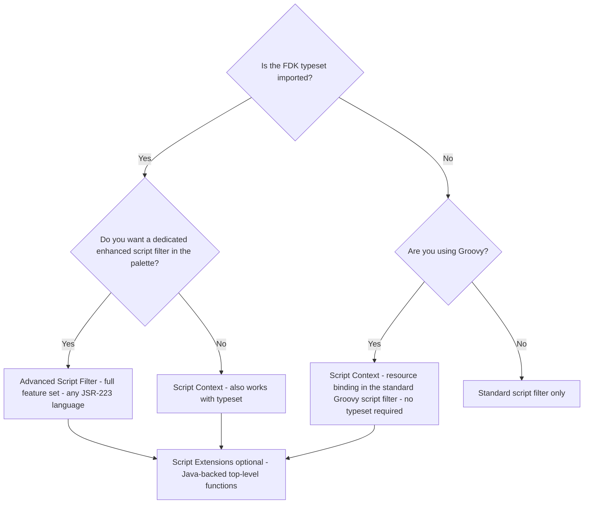
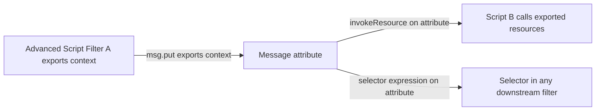

# Scripting Guide

This guide covers all FDK scripting features: the **Script Context**, the **Advanced Script Filter**, and **Script Extensions**. Read [Concepts](Concepts.md) first — especially the Resources and Script lifecycle sections.

---

## Choosing the right scripting feature



> **Without the typeset, the Advanced Script Filter does not exist at all** — the filter type is not registered in the Entity Store and does not appear in the palette. This is not a question of missing features; the filter is simply absent. Use Script Context for Groovy scripts when the typeset is not installed.

---

## Extension instantiation: per-script vs singleton

The FDK instantiation behaviour for Script Extensions and Extension Context depends on whether the typeset is installed:

| | With typeset | Without typeset |
|---|---|---|
| **Script Extensions** | Single shared instance, instantiated once at startup | One new instance created per script that calls `attachExtension()` |
| **Extension Context** | Single shared instance registered in the global JUEL namespace | Static methods only; reflectable into Script Context via `reflectClass()` |

Design your extensions accordingly: if they hold mutable state, per-script instantiation gives each script an isolated copy, while the singleton mode shares state across all scripts on the same gateway instance.

---

## Script Context

**Script Context** is for Groovy scripts running in the standard gateway Script Filter. It gives you the FDK resource API without requiring the typeset.

> The stock Script Filter does not implement the attach/invoke/detach lifecycle. A Script Context exported by one filter can be retrieved from the message by another script, but a Script Context cannot be created inside the stock Script Filter.

### Setup

A single top-level Groovy call must appear before `invoke`. It receives a builder closure where you declare your resources:

```groovy
import com.vordel.circuit.filter.devkit.script.context.ScriptContextBuilder

ScriptContextBuilder.bindGroovyScriptContext(this, { builder ->
    // Declare resources here (see ScriptContextBuilder reference)
})

def invoke(msg) {
    // Use resources here
    return true
}
```

### Binding resources

Resources are bound programmatically — the Resources tab GUI is only available in the Advanced Script Filter.

```groovy
ScriptContextBuilder.bindGroovyScriptContext(this, { builder ->
    // Selector with type coercion
    builder.attachSelectorResourceByExpression("name", "http.querystring.name", String.class)

    // Policy by portable ESPK
    builder.attachPolicyByPortableESPK("validate",
        "<key type='CircuitContainer'>" +
        "<id field='name' value='Policy Library'/>" +
        "<key type='FilterCircuit'><id field='name' value='Token Validation'/></key>" +
        "</key>")

    // Policy by shorthand key
    builder.attachPolicyByShorthandKey("validate2",
        "/[CircuitContainer]name=Policy Library/[FilterCircuit]name=Token Validation")

    // KPS table by alias
    builder.attachKPSResourceByAlias("myKPS", "kpsAlias")

    // Cache by name
    builder.attachCacheResourceByName("myCache", "cacheName")

    // Reflect static methods from an existing class
    builder.reflectClass(SomeHelperClass.class)

    // Bind a script extension
    builder.attachExtension("com.example.MyScriptExtension")
})
```

### Reflecting Groovy methods as resources

Groovy methods annotated with `@InvocableMethod`, `@SubstitutableMethod`, or `@ExtensionFunction` are automatically reflected and added to the script's resource set during `bindGroovyScriptContext`.

```groovy
import com.vordel.circuit.Message
import com.vordel.circuit.filter.devkit.context.annotations.InvocableMethod
import com.vordel.circuit.filter.devkit.context.annotations.SubstitutableMethod
import com.vordel.common.Dictionary

ScriptContextBuilder.bindGroovyScriptContext(this, { builder -> })

def invoke(msg) {
    msg.put("ctx", getExportedResources())
    return invokeResource(msg, "validate")
}

@InvocableMethod
boolean validate(Message msg) {
    return msg.get("http.method") == "POST"
}

@SubstitutableMethod
String greet(Dictionary dict,
             @SelectorExpression("http.querystring.name") String name) {
    return "Hello, ${name}!"
}
```

---

## Advanced Script Filter

The **Advanced Script Filter** is a dedicated filter type that appears in the Policy Studio palette. It requires the FDK typeset — without it, the filter type does not exist. All JSR-223 languages are supported.

The filter is backward compatible with the stock gateway scripting filter: existing scripts run unchanged. FDK capabilities are unlocked progressively through explicit declarations in the `attach` hook.

### Lifecycle

See [Concepts — Script lifecycle](Concepts.md#script-lifecycle). The three functions `attach`, `invoke`, and `detach` map directly to the lifecycle phases.

```javascript
function attach(ctx, entity) {
    // Configuration only.
}

function invoke(msg) {
    return true;
}

function detach() {
    // Release resources allocated in attach(), if any.
}
```

### Calling a policy

Add a policy in the Resources tab with the name `validate`. Then:

```javascript
function invoke(msg) {
    return invokeResource(msg, "validate");
}
```

### Resolving a selector

Add a selector expression in the Resources tab with the name `clientName`, bound to `http.querystring.name` with coercion set to `String`. Then:

```javascript
function invoke(msg) {
    var name = substituteResource(msg, "clientName");
    // name is a String, or null if the attribute did not exist.
    return true;
}
```

> The FDK resource system detects incomplete resolution and returns `null` rather than the raw `[invalid field]` string. See [Concepts — Selector internals](Concepts.md#incomplete-resolution).

### Runtime function reference

| Function | Available in | Returns |
|---|---|---|
| `getContextResource(name)` | All phases | Raw resource object |
| `getInvocableResource(name)` | All phases | `InvocableResource` or `null` |
| `getFunctionResource(name)` | All phases | `FunctionResource` or `null` |
| `getSubstitutableResource(name)` | All phases | `SubstitutableResource` or `null` |
| `getKPSResource(name)` | All phases | `KPSResource` or `null` |
| `getCacheResource(name)` | All phases | `CacheResource` or `null` |
| `invokeResource(msg, name)` | invoke | `Boolean` or `null` |
| `invokeFunction(dict, name, args)` | invoke (Groovy only) | return value or `null` |
| `substituteResource(dict, name)` | invoke | substitution result or `null` |
| `getExportedResources()` | invoke | `ContextResourceProvider` |
| `getFilterName()` | All phases | `String` |
| `setUnwrapCircuitAbortException(bool)` | **attach only** | void |
| `setExtendedInvoke(bool)` | **attach only** | void |
| `attachExtension(fqn)` | **attach only** | void |
| `reflectResources(this)` | **attach only** (Groovy) | void |
| `reflectEntryPoints(this)` | **attach only** (Groovy) | void |

### Configuration-only functions

**`setUnwrapCircuitAbortException(true)`** — allows the script to throw `CircuitAbortException`. Without this, exceptions are not propagated to the circuit. Also applies to calls into Script Extensions.

**`setExtendedInvoke(true)`** — passes the `Circuit` object as the first argument to `invoke(circuit, msg)`, for compatibility with Script Quick Filters.

**`attachExtension("com.example.MyInterface")`** — binds a Script Extension to this script by fully qualified interface name.

### Groovy-specific: reflected entry points

Instead of the JSR-223 generic `invoke(msg)`, Groovy scripts can use strongly-typed method signatures with injected parameters. Call `reflectEntryPoints(this)` in `attach`:

```groovy
import com.vordel.circuit.CircuitAbortException
import com.vordel.circuit.Message
import com.vordel.circuit.MessageProcessor
import com.vordel.config.Circuit
import com.vordel.config.ConfigContext
import com.vordel.es.Entity

void attach(ConfigContext ctx, Entity entity) {
    reflectEntryPoints(this)
}

boolean invoke(Circuit c, Message msg, MessageProcessor p)
        throws CircuitAbortException {
    return true
}
```

Injectable parameters for `invoke`: `Circuit`, `Message`, `MessageProcessor` — any subset, any order.
Injectable parameters for `detach`: `MessageProcessor` only.

When using reflected entry points, `CircuitAbortException` is implicitly unwrapped.

---

## Exporting resources to the message

Any Advanced Script Filter can export its full resource set into a message attribute. Other scripts and selectors downstream can then use those resources.



```groovy
// Script A — producer
def invoke(msg) {
    msg.put("shared", getExportedResources())
    return true
}
```

The exported `ContextResourceProvider` does not expose `getKPSResource()` or `getCacheResource()` shorthand methods — those are only valid as top-level functions in a live script context.

When the exported context is accessed from a JUEL selector expression, resources that implement `ViewableResource` are automatically represented with JUEL-adapted syntax. KPS and cache resources both implement this interface:

```
// KPS resource bound as "users" — mirrors the native kps.<alias> API
// These two expressions are equivalent:
${kps.usersAlias.username}
${exported.users.username}

// Cache resource bound as "sessions" — exposed as a JUEL Map
${exported.sessions['sessionId']}
${exported.sessions.sessionId}
```

The exported form carries an Entity Store dependency link — the KPS table is tracked by Policy Studio and survives alias changes. The native `kps.<alias>` form does not provide this guarantee.

See [Concepts — ViewableResource](Concepts.md#viewableresource) for the full explanation.

---

## Script Extensions

**Script Extensions** package Java code as top-level functions injected into any script that requests them.

### Instantiation

Without the typeset, each script that calls `attachExtension()` gets its own private instance of the extension. With the typeset, a single shared instance is created at startup and reused by all scripts. See [Extension instantiation: per-script vs singleton](#extension-instantiation-per-script-vs-singleton) above.

### When to use Script Extensions vs Extension Context

| | Script Extensions | Extension Context |
|---|---|---|
| Callable from scripts | Yes, as top-level functions | Yes, via `invokeResource` |
| Callable from selectors | No | Yes — registered at configuration time (not invocation time), message injected from resolver context, argument types coerced automatically |
| Can access calling script's resources | Yes | No |
| Typeset required for singleton | Yes | Yes |

### Implementation

**Interface:**

```java
public interface GreetingExtension {
    String greet(String name);
}
```

**Implementation:**

```java
import com.vordel.circuit.filter.devkit.script.extension.annotations.ScriptExtension;

@ScriptExtension(GreetingExtension.class)
public class GreetingExtensionImpl implements GreetingExtension {
    @Override
    public String greet(String name) {
        return "Hello, " + name + "!";
    }
}
```

**Binding in an Advanced Script Filter:**

```javascript
function attach(ctx, entity) {
    attachExtension("com.example.GreetingExtension");
}

function invoke(msg) {
    var message = greet("World"); // top-level function, no qualifier needed
    com.vordel.trace.Trace.info(message);
    return true;
}
```

**Binding in a Groovy Script Context:**

```groovy
ScriptContextBuilder.bindGroovyScriptContext(this, { builder ->
    builder.attachExtension("com.example.GreetingExtension")
})
```

> Methods with variable argument lists cannot be exported to JavaScript.

### Script Extensions that read the calling script's resources

Extend `AbstractScriptExtension` to access `invokeResource()` and `substituteResource()` on the calling script's own resources:

```java
import com.vordel.circuit.filter.devkit.script.extension.AbstractScriptExtension;
import com.vordel.circuit.filter.devkit.script.extension.ScriptExtensionBuilder;
import com.vordel.circuit.filter.devkit.script.extension.annotations.ScriptExtension;

@ScriptExtension(AuditExtension.class)
public class AuditExtensionImpl extends AbstractScriptExtension
        implements AuditExtension {

    protected AuditExtensionImpl(ScriptExtensionBuilder builder) {
        super(builder);
    }

    @Override
    public boolean auditAndInvoke(Message msg, String policyName) {
        Object auditId = substituteResource(msg, "auditId");
        Boolean result = invokeResource(msg, policyName);
        return result != null && result;
    }
}
```

### Adding resources to the calling script

Override `attachResources(ScriptExtensionBuilder builder)` from `ScriptExtensionConfigurator` to add resources to the calling script's context during its `attach` phase.

### Extension lifecycle

If a Script Extension needs its own startup and shutdown lifecycle (e.g. to open a connection pool or register a background thread), implement `ExtensionModule`. See [Java Extensions — ExtensionModule](JavaExtensions.md#extensionmodule-lifecycle).
